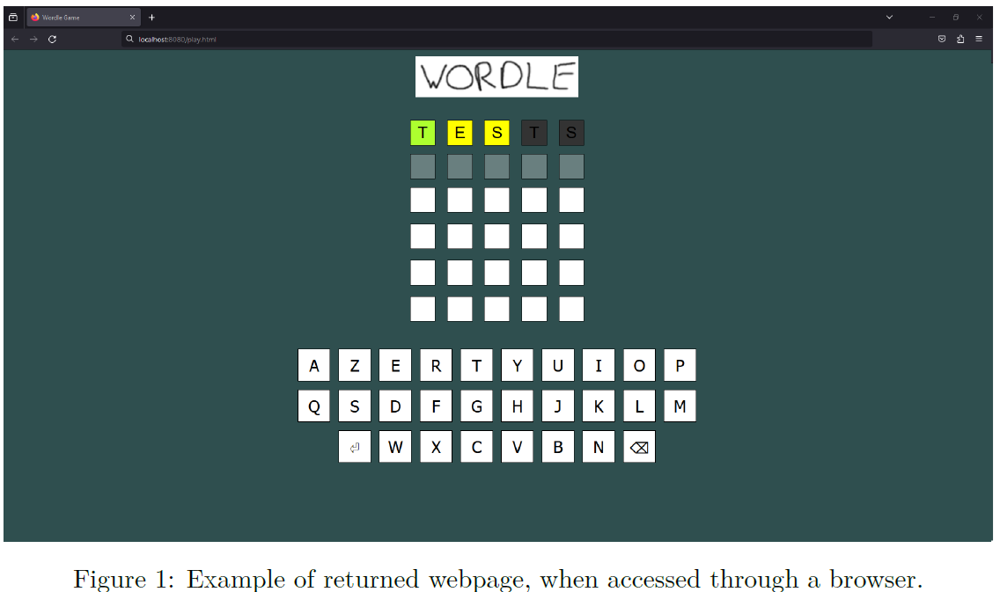
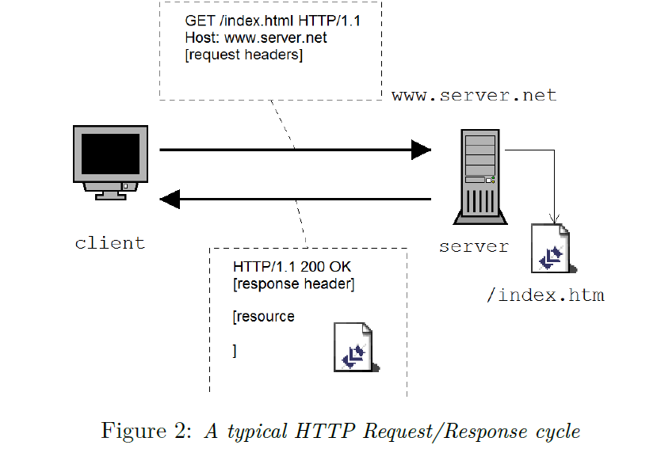

# (INFO0010-4) WordleGame Project
*Introduction to computer networking (23-24)*

```
Abstract
In this assignment, students will have to implement a server application using Java Sockets.
The server uses the HTTP protocol to provide an interactive Wordle game to its clients. The server will act as the "secret keeper" and provide some information about the secret word. Users will propose words and try to deduce, according to the pieces of information they receive, the secret. This assignment will use the following additional concepts: page redirection, javascript, AJAX, POST methods, GET methods (incl. parameters), session cookies, compression, chunked encoding and thread pools.

Students will work in teams of 2 students. The Hard Deadline for this project is December 11 th, 2023.Sections 1 and 2 define your assignment objectives. Sections 3 and further are an executive summary of the technologies we use.
```
## 1. Wordle

As stated in the abstract, you will implement an HTTP platform in order to play Wordle using Java Sockets. An example of what the website might look like is given on Figure 1. The server waits for TCP connections on a given port, and can handle HTTP GET and HTTP POST requests through that connection when established. Every HTML page returned by your server does not correspond to a file on disk, but is dynamically generated in your java source code.


An HTTP GET method is used to:
1. request the root page or theplay.htmlpage of the server.
2. request an evaluation of a word guessed by the user through an AJAX request. The server would then respond to this AJAX request by providing the coloring of the word indicating if a letter is well-placed, miss-placed or absent.

An HTTP POST (see Section 3) method is used to request an evaluation of the combination in the case where javascript is disabled on the browser.


The server will be up for new connections (as long as there still are available threads) and be able to handle concurrency. As soon as a request has been served, the inherent TCP connection will be closed. Coherent state of the game for the users will be achieved through session cookies.


You don’t have to write a corresponding client code: the browser is the client.



### 1.1. Launch

The server software is invoked on the command line with one additional argument: ``java WordleServer maxThreads``

where $maxThreads$ is the maximum number of java Threads that can be run in a concurrent way to handle the requests. One can also see this argument as the maximum number of requests that can be treated "simultaneously" (see section 9).

The server listens on port $80xx$ – where $xx$ is your group ID.

### 1.2. Page layout

You are free to design the pages as you want but each pages must have the following:

- the provided logo (logo.png file) as a base64 encoded image (See section 5.2)
- 6 rows that displays the colored passed guessed, current guess and remaining tries
- a keyboard to fill in the current guess if javascript is enabled

### 1.3. Incorrect or incomplete commands

When dealing with network connections, you can never assume that the other side will behave as you expect.

It is thus your responsibility to check the validity of the client’s request (and respond with the correct status code) and to ensure that a malevolent person won’t make your server freeze by initiating a TCP connection and keep it open for an indefinite period of time (see Section 9 for a counter-measure).

### 1.4. Page Redirection

A call to the root page ("/") will redirect to ``play.html``.

### 1.5. Javascript and AJAX

Javascript is a programming language designed for programs that are executed by the browser itself, i.e. client side, without any intervention of the server. It allows local treatment to remove some CPU load from the server. It is generated by the server and
embedded in the HTML code or in a distinct .js file.

Given that javascript is enabled on the browser, the user will have the possibility to create their guess by simply clicking on the letters on the keyboard before submitting it.

When the user clicks on submit, an AJAX request is initiated to ask the server to inspect the selected combination. The AJAX request is a GET request which the server responds with the coloring.

Javascript can be disabled. Hence, it is the responsibility of the programmer to cope with the will of the user, and provide a regular form that will trigger a POST request in that case.

### 1.6. Chunked encoding

The content of ``play.html`` will be transferred to the client by using _Chunked encoding_ (See Section 7). Chunks will have a maximum size of 128 bytes.

### 1.7. Compression*

The content of ``play.html`` can be compressed using Gzip compression (see Section 8) for bonus points.

### 1.8. Sessions

User authentication is performed by the use of session cookies (see Section 6).

When a user connects to the server for the first time, the latter will generate a random value, which will be used as session ID. This ID is transferred to the client as a cookie, such that each time the client connects to the server using the same browser, its
authentication remains valid.

The user does not have the possibility to close its session, but the cookie will have a lifetime of 10 minutes, after which the server will invalidate the session cookie.

### 1.9. HTTP return codes

As described in section 3, the HTTP response contains a return code whose value is an indicator of the success of the handling of the request.

Implementing your server in such a way that it uses all possible HTTP return codes would go beyond the scope of this assignment.

However, you should at least use the following return codes: 200, 303, 400, 404, 405, 411, 501 and 505.

## 2. Guidelines

- You will implement the programs using Java 1.8, with packages ``java.lang``, ``java.io``, ``java.net``, ``java.awt``, ``javax.imageIO`` and``java.util`` ,
- You will ensure that your program can be terminated at any time simply using CTRL+C, and avoid the use of ShutdownHooks
- You will not manipulate any file on the local file system apart from reading the logo.png file. The ``WordleWordSet.java`` file and logo.png file are provided to you. **You must not modify nor include them in the archive**.
- You will ensure your main class is named WordleServer, located in ``WordleServer.java`` at the root of the archive, and does not contain any package instruction.
- You will not clutter your program in packages or directories. All java files should be found in the same directory.
- You will ensure that your program is fully functional (i.e. compilation and execution).

Your program will be completed with a .pdf report (in the zip package) addressing the following points:

**Software architecture:** How have you broken down the problem to come to the solution? Name the major classes responsible for requests processing.

**Multi-thread coordination:** How have you synchronized the activity of the different threads?

**Limits:** Describe the limits of your program, esp. in terms of robustness.

**Possible Improvements:** This is a place where you’re welcome to describe missing features or revisions of these specifications that you think would make the server richer or more user-friendly.

## 3. The HTTP Protocol

HTTP is an client/server applicative protocol that enables _resources_ to be shared between machines based on their symbolic names (the _URL_ s). “Resource” is a generic term that can encompass both a file or content generated dynamically from a database (e.g. using CGI or PHP). 

Main methods (i.e. actions that a client can invoke on an HTTP server) retrieve content or meta-data (i.e. content type, last modification timestamp) for a specific resource. The ``GET`` method retrieves both content and meta-data, while ``HEAD`` only retrieves meta-data.

The protocol also defines additional methods to upload content (``POST``) as well as ways to ``PUT`` and ``DELETE`` resources on a server. In this work, only ``GET`` and ``POST`` methods will be used.

As many applicative protocols defined by IETF, HTTP is a _text-oriented_ protocol, meaning that all exchanges are intended to be human-readable (as opposed to “binary” protocols such as IP, TCP and BitTorrent that feature custom information packing).
Each request and reply is made of multiple lines of text, usually with only one chunk of information per line.



```
<http-request> ::= <method-name> <url> HTTP/ <http-version> CRLF
<http-headers> CRLF
CRLF
```

**HTTP Request Overall Syntax**

```
<method-name>   names the operation to take place
```
```
<url>   indicates which resource is to be manipulated. Note that it usually only provides the path and query part of the resource’s location (unless Web proxy is involved).
```
```
<http-version>  is the protocol’s version. We will exclusively work with version 1.1, as described in RFC2616.
```

```
<CRLF>  are two control characters used as line terminators (\r\n in Java).
Watch out: software exists that do not obey the standards and solely use theLFcharacter as line terminator.
```
```
<http-headers>  Any number of optional header lines to define preferences over content type, required freshness, etc. They follow the generic format
<option-name> **:** <option-value>.
```

Providing extra information “one line at a time” allows fairly simple extension of the protocol, as options that are not recognized by an entity (either client or server) can easily be discarded. The precise syntax and semantic of the HTTP headers are defined in section 14 of the RFC 2616 describing the HTTP/1.1 protocol.

**Overall HTTP reply syntax**
```
<http-response> ::= HTTP/ <http-version> <ret-code> <status> CRLF
<http-headers> CRLF
CRLF
[response-body]
```

```
<ret-code>  is a numerical value defining whether the request could be handled properly, that is intended to be used by the client software. The first digit indicates the success level (1=ongoing, 2=successful, 3=reiterate, 4=client-side error, 5=server-side error) while the last two digits further refine the type of error or to what extent the request could be fulfilled.
```
```
<status>    is a human-readable message matching theret-codethat could be displayed to the end-user.
```
```
<http-headers>  provide additional information on the content type, size, the encoding used to deliver it over the channel, etc.
```
```
<response-body> is the actual resource’s content (when found). Note that the body may be empty for some methods.

```
**POST methods**
POST methods differ from GET methods as some additional content is provided after the request header. As for HTTP server responses, it provides a ``Content-Length`` field whose value is the number of bytes to be read after the end of the header.

POST methods are usually triggered after the user clicked on a submit button of a HTML form.

## 4. Redirection Mechanism

The redirection mechanism allows the server to request the browser to generate a new GET request without the need for the user to do anything.


There are at least two ways to perform a redirection:

1. Return with the code ``303 See Other``  instead of ``200 OK`` and provide a field ``Location`` with the location of the new webpage. e.g.: 
    ```http
    HTTP/1.1 303 See Other
    Location: http://localhost:8010/graphView.html
    ```
2. Return with the code ``200 OK``, but replace the content with a Javascript command to change the location. e.g.:
    ```http
    HTTP/1.1 200 OK
    Content-Length: 52
    other header fields

    <script>document.location="graphView.html";</script>
    ```

## 5. Javascript

Using Javascript, one can monitor several events, such as a mouse click (MouseDown) or a key being pressed (KeyPressed) and assign a function to deal with that event. One can also dynamically modify the HTML code, and point to a particular tag using, for
example, ``document.getElementById()``.

Note that Javascript can be disabled by the user, but every HTML code that is between a ``<NOSCRIPT>`` tag will be executed when Javascript is disabled.

### 5.1`. AJAX

AJAX, which stands for Asynchronous JAvascript and Xml, allows the browser to dynamically issue some short requests to the server, so that the reloading of the entire page is not necessary. Usually, the browser uses the ``XMLHttpRequest`` method to issue a GET request to the server, and treats the response asynchronously when it arrives.

### 5.2. Base

Base64 is an encoding method that allows binary data (e.g. images) to be represented as text. The principle is that the data stream is seen in binary (8-bits for each byte), then the stream is scanned, and each group of 24 bits is split into 4 groups of 6 bits (hence, 64 possible values for each group). Each possible value matches an ASCII character using a conversion table.

For example, the following data sequence: 5 10 15 (in decimal, each integer encoded in one byte) would become “BQoP” in base64. Every data stream can be represented in text, with the price of a larger space usage, because you now use a byte for every 6 bits of information.

A BufferedImage can easily be transformed into base64 in Java, using the following code:
```java
final ByteArrayOutputStream os = new ByteArrayOutputStream();
ImageIO.write(image, "png", os);
String s = Base64.getEncoder().encodeToString(os.toByteArray());
```

Finally, this base64 image can be displayed inside a browser, by pasting the string into an ``img`` tag. For example:

```html

```

## 6. (Session) Cookies

Cookies are a good way of keeping track of a session. They are small text elements that the browser will store, then submit on each new request to the same server.

### 6.1. Setting a cookie

When the server wants a cookie to be set, it uses the ``Set-Cookie`` field in the response header. For example:

```http
Set-Cookie: SESSID=rk64vvmhlbt6rsdfv4f02kc5g0; path=/
```
will create (or replace) a cookie whose key is ``SESSID`` and whose value is ``rk64vvmhlbtrsdfv4f02kc5g0``, at the root and wihout any expiration time. Thus, on each new request, the browser will add
```http
Cookie: SESSID=rk64vvmhlbt6rsdfv4f02kc5g
```
in its request header.

### 6.2. Deleting a cookie

To delete a cookie, the server just has to update it with an expired expiration date.

Note that some browser discard the expiration date, so a good practice is to also update the content of the cookie with an invalid value. E.g.:
```http
Set-Cookie: SESSID=deleted; path=/; expires=Thu, 01 Jan 1970 00:00:GMT
```

## 7. Chunked encoding

Chunked Transfer Encoding is a data transfer mechanism, since HTTP/1.1, that allows the server to start the transmission of some blocks without having to know in advance the size of the whole content.

Instead of using the ``Content-Length`` field, the server will provide a ``Transfer-Encoding`` field, with the valuechunkedfor that field. Then, after the response header, the server will send data blocks, starting with the size of each block (in Hexadecimal). The transfer is finished when the server sends a block of size 0.

For instance, the server could respond with:
```http
HTTP/1.1 200 OK
Content-Type: text/plain
Transfer-Encoding: chunked

18
This is a first chunk.

1A
And this is another one.

1C
But this one is cut in half
17
without carriage return
0
```

which will be reconstructed as
```
This is a first chunk.
And this is another one.
But this one is cut in half without carriage return
```

## 8. Gzip compression

Webpages that tend to have a large content are often compressed, if the client accepts that (using the ``Accept-Encoding`` field).

This can be achieved simply by sending the webpage content through a ``java.util.zip.GZIPOutputStream``, and by sending that compressed content to the ``OutputStream`` of the socket.


However, you should consider the following implications:

1. As gzip-encoded data are binary data and not text, particular attention should be given to the charset encoding. The selected charset should be explicitly specified at the creation of the Gzip output stream, provided to the client using the ``charset`` parameter of the ``Content-Type`` field, and, of course, given that this charset is accepted by the browser (in the ``Accept-Charset`` field of the request header).
2. When Gzip compression is combined with chunked encoding on server side (to manipulate the response before transmitting it to the client), compression is always performed first, then chunked encoding is performed on the compressed data, and not the other way around.

## 9. Thread Pool

When a server accepts a connection, it usually invokes a new _thread_ that will handle that connection, so that the server can go back to listening to the port. This is very convenient to guarantee a certain level of accessibility but also has a flaw.

The _(Distributed) Denial of Service_ (or(D)Dos) is an attack that targets servers with this kind of behaviour. In this attack, one (for DoS) or several (for DDoS) machines initiate many bogus connections. If the server launches a new thread for each of these
connections, it will soon encounter performance problems or even crash.

To circumvent this problem, one can use a _Thread Pool_ that limits the number of threads that can be executed concurrently, while keeping the other jobs on hold until new threads become available. This thread pool can be implemented through the use of ``java.util.concurrent.Executors`` by calling the
```java
new FixedThreadPool(int maxThreads)
```
method to create a fixed-size pool of _maxThreads_ threads and calling the 
```java 
execute (Runnable worker)
``` 
method to assign the work represented by _worker_ to one
of a thread in the pool, when available.


You can (and are encouraged to) use a thread pool in your assignment.

Good programming...
